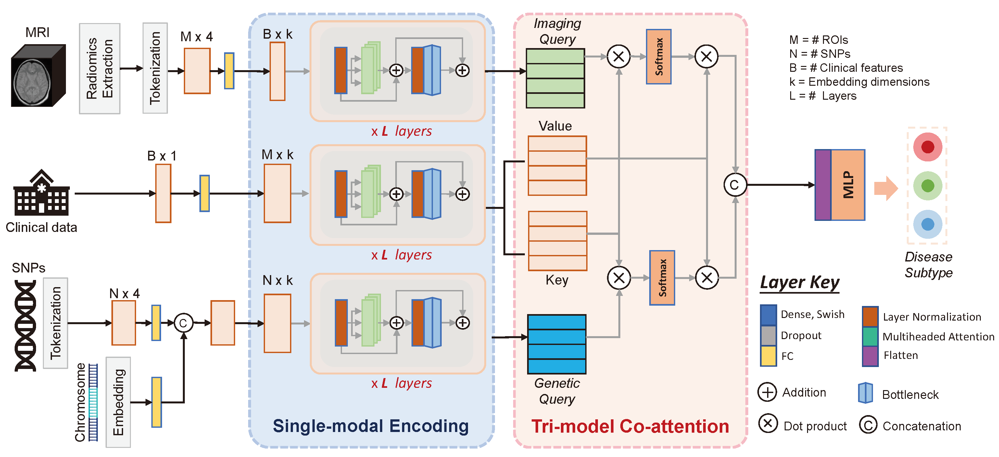

# Tricoat

This repository contains the Tricoat project.  
Public version under construction.

Publication can be found at: https://www.mdpi.com/2075-4426/14/4/421

## Description

This repository implements **Tri-COAT** (Tri-Modal Co-Attention Transformer), a multimodal deep learning framework for early-stage, progression-specific Alzheimer's disease subtyping. Tri-COAT explicitly fuses imaging (MRI-derived quantitative traits), genetic (SNP dosage, odds ratios, allele frequencies, chromosome embeddings), and clinical assessment data via a tri-modal co-attention mechanism to learn cross-modal feature interactions and provide interpretable predictions. On the Alzheimer's Disease Neuroimaging Initiative (ADNI) dataset, Tri-COAT achieves state-of-the-art classification AUROC while highlighting key biomarker associations :contentReference[oaicite:0]{index=0}.

## Model Architecture



The Tri-COAT architecture consists of three parallel branches that process different modalities:
1. **Imaging Branch**: Processes MRI-derived quantitative traits through self-attention
2. **Genetic Branch**: Encodes SNP data and genetic metadata using transformer encoders
3. **Clinical Branch**: Embeds clinical assessment scores

These branches are fused through our novel tri-modal co-attention mechanism that enables cross-modal feature learning. The fused representations are then passed through classification layers to predict AD progression subtypes.


## Getting Started

1. **Clone the repository**  
   ```bash
   git clone https://github.com/DiegoMac17/tricoat
   cd tricoat
   ```

2. **Install dependencies**
   ```bash
   pip install -r requirements.txt
   ```

3. **Download and prepare the data**
    Data can be downloaded from the [Alzheimer's Disease Neuroimaging Initiative (ADNI) repository](https://adni.loni.usc.edu/data-samples/accessing-adni-data/).

    The data should be organized as follows:
    ```
    data/
    imaging/    # CSV or NumPy arrays of ROI traits
    genetics/   # CSV with SNP dosage + metadata
    clinical/   # CSV with clinical scores
    ```
## Usage

4. **Run the model**

   The model can be run using the wrapper script with various configuration options:

   ```bash
   python wrapper.py [options]
   ```

   Key arguments:
   - `-fo, --fname_out_root`: Prefix name for output files (default: 'ADNI_gradient_explore')
   - `-gpu`: GPU number to use (default: '7')
   - `-tune`: Flag for hyperparameter tuning (0: no tuning, 1: tune)
   - `-ab`: Model ablation type ('full', 'img', 'gen', 'clin')
   - `-kfeat`: Number of top features to plot (default: 50)
   - `-gpu_tr`: GPUs per trial for tuning (default: 1)

   Model architecture parameters:
   - `-k_dim`: Transformer dimension (default: 256)
   - `-u, --units`: Number of units in FC layers (default: 128)
   - `-nl_s`: Number of layers in single modality (default: 4)
   - `-nl_j`: Number of layers in joint modality (default: 2)
   - `-nh`: Number of attention heads (default: 4)
   - `-dp_tf`: Transformer dropout (default: 0.0)
   - `-dp_fc`: FC layer dropout (default: 0.3)

   Example commands:
   ```bash
   # Run full model with default settings
   python wrapper.py -fo ADNI_large -gpu 0 -tune 0 -kfeat 50

   # Run with image modality ablation and tuning
   python wrapper.py -fo ADNI_img_abl_tune -gpu 5 -tune 1 -ab img -gpu_tr 0.2

   # Run with clinical modality ablation and tuning
   python wrapper.py -fo ADNI_clin_abl_tune -gpu 5 -tune 1 -ab clin -gpu_tr 0.1

   # Run with genetic modality ablation and tuning
   python wrapper.py -fo ADNI_gen_abl_tune -gpu 5 -tune 1 -ab gen -gpu_tr 0.25

   # Run with full ablation and custom architecture
   python wrapper.py -fo ADNI_full_abl_tune -gpu 5 -tune 1 -ab full -gpu_tr 0.5 -kfeat 50 -k_dim 512 -u 512 -m_p_f 1 -dp_tf 0.0 -dp_fc 0.3
   ```

## License

This project is licensed under the MIT License. See the [LICENSE](LICENSE) file for details.

## Contact

For questions or feedback, please contact us at [machad@rpi.edu](mailto:machad@rpi.edu).
